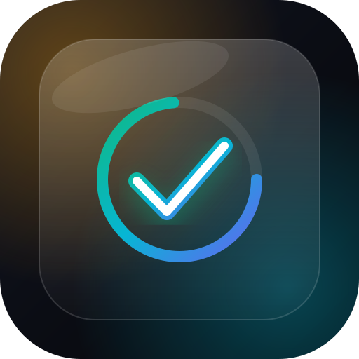

# 📱 Task Tracker — iOS PWA (Dark Glassmorphism)

Премиальное, плавное и 100% автономное PWA-приложение для ведения задач с планированием на **«Неделю»** и **«Месяц»**, оптимизированное для работы на **iPhone** (Safari & Home Screen).



---

## ✨ Особенности и функционал

- 🌌 **iOS Dark Glassmorphism:** Глубокий темный фон `#090b10`, неоновые световые сферы (ambient mesh glow), матовое стекло `backdrop-filter: blur(24px)` и системные шрифты Apple SF Pro.
- 🎛️ **Segmented Control из 2 вкладок:**
  - 🗓️ **«Неделя» (по умолчанию):**
    - 7-дневная компактная лента (Пн–Вс) с цветовыми индикаторами активности (🟢 все задачи закрыты, 🟡 есть задачи в работе, ⚪ есть задачи в плане).
    - Список задач недели с удобной группировкой по дням.
    - Адаптивный счетчик: *«Прогресс недели (X из Y сделано • Z%)»*.
  - 📊 **«Месяц»:**
    - Навигация по месяцам (напр., *«Август 2026»*).
    - Сводный блок аналитики (Всего, В работе, Выполнено, Успешность %).
    - Список стратегических задач и целей на месяц.
    - Адаптивный счетчик: *«Прогресс месяца (X из Y сделано • Z%)»*.
- 🔄 **3-фазный статус карточки:**
  - ⚪️ **План (todo):** нейтральный серебристый круг
  - ⏳ **В работе (in_progress):** теплый янтарный (`#f59e0b`) с анимированной индикацией
  - ✅ **Готово (done):** изумрудно-мятный (`#10b981`), салют конфетти (`canvas-confetti`), вибро-отклик и перемещение в блок завершенных
- 🏝️ **Плавающая панель ввода («Dynamic Island»):**
  - Привязана к безопасной зоне `env(safe-area-inset-bottom)`.
  - На вкладке «Неделя» — задача привязывается к выбранному дню недели / текущей неделе.
  - На вкладке «Месяц» — задача добавляется в стратегические цели месяца.
- 📴 **100% Офлайн & Автономность:** хранение данных в `localStorage`, Service Worker (`sw.js`) для кэширования всех ресурсов.
- 👆 **Мобильные жесты:** свайп карточки влево для удаления с возможностью отмены (Undo Toast).

---

## 📂 Структура проекта

```
ios-task-pwa/
├── index.html          # Главная разметка, метатеги Task Tracker, PWA манифест
├── style.css           # Дизайн-система iOS Dark Glassmorphism, 2-tab control, safe areas
├── app.js              # Реактивная логика (Неделя / Месяц), localStorage, конфетти
├── manifest.json       # Web App Manifest (Task Tracker)
├── sw.js               # Service Worker (кэширование и офлайн)
├── icon.svg            # Векторная иконка приложения
└── README.md           # Документация
```

---

## 🚀 Как запустить локально

```bash
cd C:\Users\AlexNGG\.gemini\antigravity\scratch\ios-task-pwa
python -m http.server 3000
```
Откройте в браузере: `http://localhost:3000`

---

## 📲 Как установить на iPhone (iOS Home Screen)

1. Задеплойте файлы на любой бесплатный хостинг с HTTPS (**Vercel**, **GitHub Pages**, **Cloudflare Pages**).
2. Откройте ссылку в **Safari** на iPhone.
3. Нажмите **«Поделиться»** (иконка со стрелкой вверх) -> **«На экран "Домой"»**.
4. Нажмите **«Добавить»**. Приложение установится как автономный нативный PWA **Task Tracker**!
